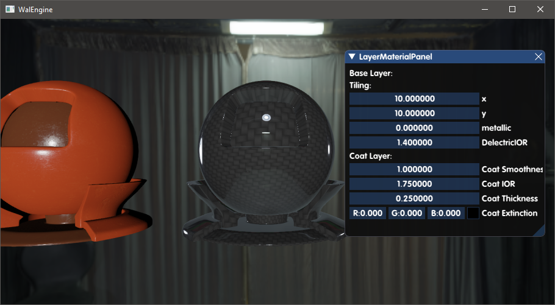
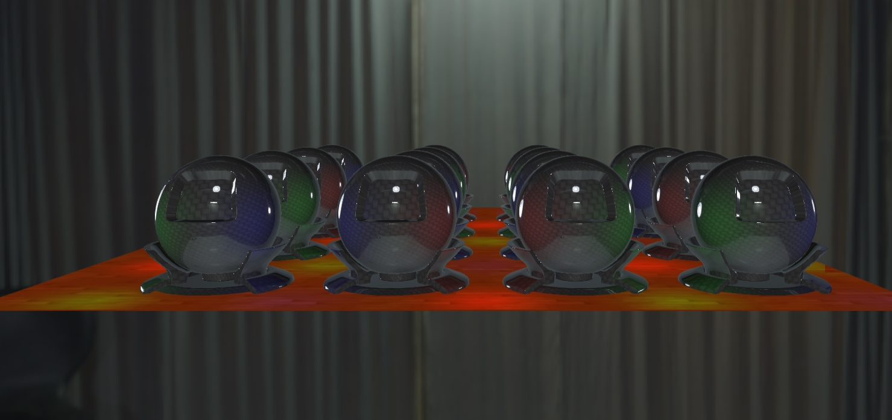
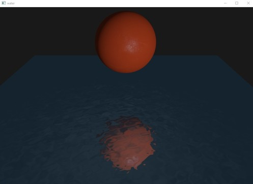

# WalEngine

## TODO
### Effect
- **AA**
	- [x] FxAA
	- [ ] TAA

- **Shadow**
	- [x] VSM

- **PBR**
	- [x] Layered Material PBR (clear coat)
	- [x] IBL
	- [ ] Anisotropic model
	- [ ] Cloth model
- **AO** 
	- [ ] temporal SSAO
	- [ ] GTAO

- **Screen Space Effect**
	- [ ] SSS
	- [ ] SSR
	- [ ] SSD
- - [ ] **Voxelize**
- - [x] **Water**
- **Volume Effect**
	- [ ] Fog
- **Post Processing**
	 - [ ] Motion Blur
	 - [ ] Depth Of Field
	 - [ ] Bloom
	 - [ ] Lens flares
### Rendering
- [x] Material Complie
- [x] Scene Graph
- **Lights** 
	- [x] Point, Spot, Directional
	- [ ] Area Light(LTC)
- **Light Path**
	- [x] Tiled Based Forward
	- [ ] Tiled Based Deferred
	- [ ] Clustered Deferred
- [x] SkyBox
- [x] Entity-Component System
- [x] Mesh
- **Graphic API**
	- [x] OpenGL
	- [ ] DirectX 11/12
- [ ] Physics Lib
- [ ] Transparent Rendering
- [ ] Support LOD
- [ ] Particle System
- [ ] Baking
### GUI
- [x] Menu
- [x] Panel
- [ ] Gizmos
### Off-Rendering
- [ ] Ray Tracer

## Gallery
#### Layered Material PBR

#### Forward+

#### Water

